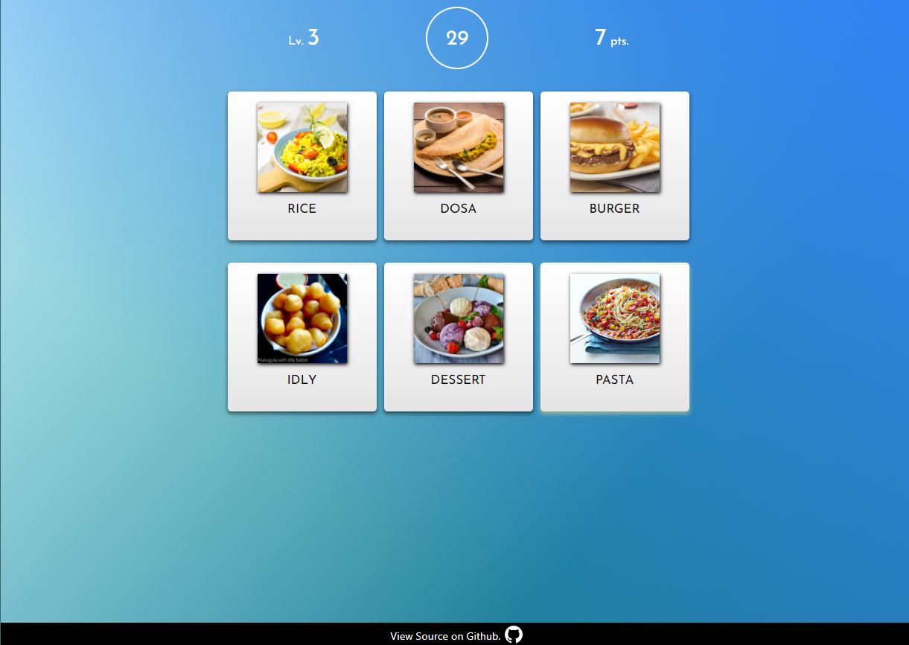

# Memory Cards with American / Indian Cuisines

**View Demo: https://datrinon.github.io/memorycards/**

## Features
- How good is your memory? Play cards featuring various American / Indian foods.
- 5 levels of memory-testing action. Can you beat them all? 
- Play on an optional hard mode with less time per card if you're really that good.

## Technical details
- Built with React (using `create-react-app`.)
- Utilizes React Hooks
